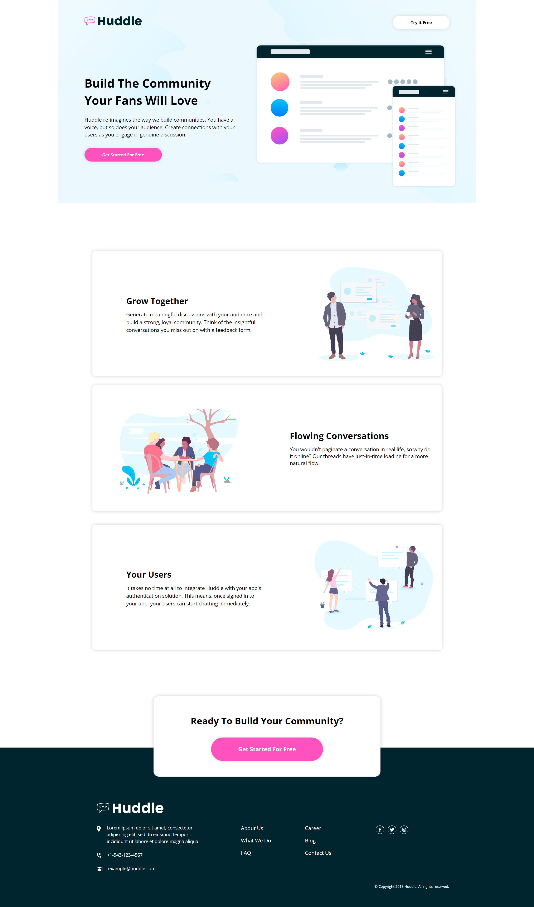
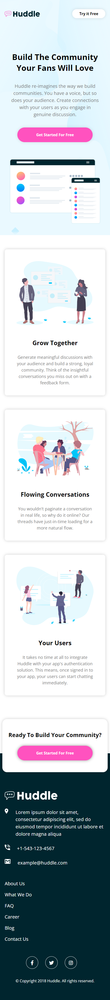

# UNDERCONSTRUCTION ⚠️ 12th of October 2022 starting -> 
# Frontend Mentor - Huddle landing page with alternating feature blocks

## Welcome! 👋

Thanks for checking out this front-end coding challenge.

[Frontend Mentor](https://www.frontendmentor.io) challenges helps improve coding skills by building realistic projects.

**To do this challenges, a basic understanding of HTML and CSS is needed.**

## The challenge

This challenge is to build out this landing page and get it looking as close to the design as possible.

# UPDATE 21st OCTOBER 2022
1) all sections - done ✅ 
2) hover effects - done ✅
3) mobile queires - missing ✅

# DESKTOP VIEW 🖥️⬇️

# MOBILE VIEW 📱⬇️

